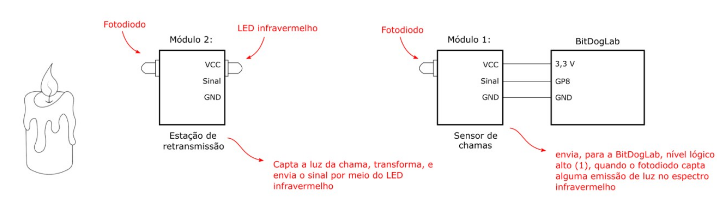
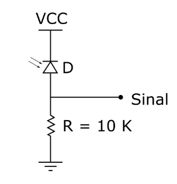
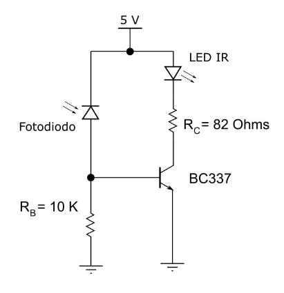
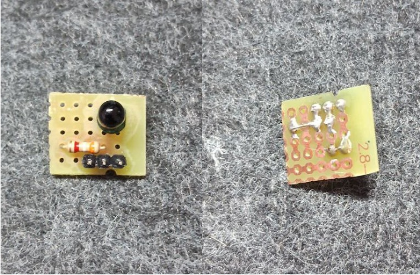
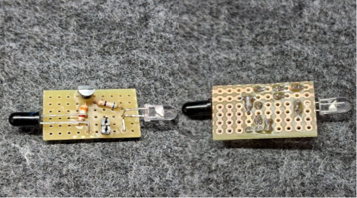

# Sensor de Chamas com Raspberry Pi Pico W

Um simples detector de chamas utilizando fotodiodo e um retransmissor com um LED infravermelho para cobrir maiores distâncias.

* Projeto construído com a [BitDogLab](https://github.com/MoisesLuc/BitDogLab-C.git) para fins educacionais.

## Diagrama e Circuitos

## Demonstração

Abaixo segue a demonstração de ambos o sensor e retransmissor, respectivamente.

